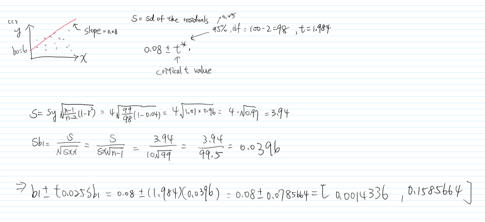
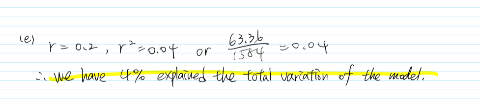

```{r setup, include=FALSE}
knitr::opts_chunk$set(echo = TRUE)
library(tidyverse)
library(car)
```
# Part 1 (20 points): Concept problems
### True or False. Justify your answer

1. The sum of the residuals is equal to zero.\
**Answer: True**
- Half of the residuals will equal exactly half of the remaining residuals. Half are positive, half are negative, and they eliminate each other out.

2. A significant positive correlation between X and Y implies that changes in X cause Y to change.\
**Answer: False**
- The strength of the linear association is measured by correlation. `r` is always a number between -1 and 1. If r is close to 0, it means there is no relationship between the variables (1 means prefect positive correlation; -1 means prefect negative correlation).

3. The residual is the difference between the observed value of the dependent variable and the predicted value of the dependent variable. In mathematical notation this is given by $Y - E\{Y\}$.\
**Answer: True**
- The difference between the observed Y and the predicted Y ($Y-\hat{Y}$) is called a residual.

4. If MSR and MSE are of the same order of magnitude, this would suggest that $\beta1 \neq 0$.\
**Answer: False**
- If the MSE and the MSR are of the same order of magnitude, this suggests that $\beta1 = 0$. If the MSR is significantly greater than the MSE, this suggests that $\beta1 \neq 0$.

5. When using simple regression analysis, if there is a strong correlation between the independent and
dependent variable, then we can conclude that an increase in the value of the independent variable causes an increase in the value of the dependent variable.\
**Answer: False**
- We need to focus on $\beta1$ to know the association between independent variable and dependent variable.

6. The least squares regression line minimizes the sum of the squared differences between actual and
predicted Y values.\
**Answer:**
- 

7. The correlation coefficient takes values between 0 and 1.\
**Answer:**
- 

8. The coefficient of determination is interpreted as the proportion of observed variation in X that can be explained by the simple linear regression model.\
**Answer:**
- 

9. One way to study the normality of the error is by histograms.\
**Answer:**
- 

10. Draw a fitted versus residuals plot where we see that the constant variance assumption is not met and the linearity assumption is not violated.\
**Answer:**
- 

# Part 2 (80 points): Exercises
1. (Use R for data analysis)
The 1974 Motor Trend US magazine contained data on fuel consumption of 32 automobiles (1973-74 models).
These data are in dataset ‘‘mtcars’’ which is already loaded in R. You can look at it with commands attach(mtcars),
names(mtcars), summary(mtcars), mtcars. Your task is to study the effect of the number of carburetors (variable
carb) on the fuel consumption in miles per gallon (variable mpg).
```{r}
mtcars
```

(a) Fit a linear regression model that can be used to predict miles per gallon based on the number of carburetors. Is the number of carburetors significant in this prediction? Report the estimated regression equation, the p-value testing significance of carburetors, and state your conclusion.
- With the p-value 0.001084, we have evidence to reject the null hypothesis in favor of an alternative hypothesis. That is, if the number of carburetors adds one unit, the miles per gallon will decrease by 2.0557 gallons.
$$
mpg = 25.8723 - 2.0557carb
$$
```{r}
reg <- lm(mpg~carb, data = mtcars) # the fuel consumption in miles per gallon ~ number of carburetors
summary(reg)
```

(b) Conduct a lack-of-fit test to decide whether the relation between the fuel consumption and the number of carburetors is linear. State the test statistic, the p-value, and your conclusion. What does this test statistic
measure?
- reduced model is the usual linear regression model, SSE(Reduced) = 784.27
- full model is treating `X` as categorical and fitting the mean at each carb. SSE(Full) = 625.49 = SSE(pure error)
- The lack of fit SSE(lack of fit) = SSE(reduced) - SSE(Full) = 784.27-625.49 = 158.78
- F = (158.78/4) / (625.49)/26 = 39.695 / 24.05731 = 1.650018
- We conclude that the p-value is 0.1918, we fail to reject the H0, meaning that there is no evidence of lack of fit. Thus, using the linear regression is almost as good as using separate means at the each level of the number of carburetors. 

```{r}
reduced <- lm(mpg ~ carb, data = mtcars) # simple linear regression predicting Y in terms of X 
full <- lm(mpg ~ as.factor(carb), data = mtcars) # using group means to predict Y for each value of X, thus treating X as a categorical variable

anova(reduced, full)
```

(c) Are there any outliers in this regression analysis? Test each residual keeping the familywise error rate at a 5% level. Explain how you did the test, report the numbers that lead to your conclusion.
- At the individual level $\alpha$ = 0.05, there is a potential outlier - observation *Toyota Corolla* with the studentized residual t =  2.169892. Then, we are going to keep the familywise error rate at the same level and using `outlierTest` for testing.

- The test provided no outiers
```{r}
# Studentized residuals and testing for outliers
t <- rstudent(reg)
par(mfrow=c(1,1)) # Return to the 1x1 plot window 
plot(t)

t[abs(t) > 2]
attach(mtcars)
n = length(carb)
qt( 0.025/n, n-2 ) # -3.478736
t[ abs(t) > abs(qt( 0.025/n, n-2 ))]
```
- According to [Quantitative Research Methods for Political Science, Public Policy and Public Administration for Undergraduates](https://bookdown.org/wwwehde/qrm_textbook_updates/ols-assumptions-and-simple-regression-diagnostics.html), they indicate the `outlierTest` is: " The Bonferroni Outlier Tests uses a t distribution to test whether the model’s largest studentized residual value’s outlier status is statistically different from the other observations in the model. A significant p-value indicates an extreme outlier that warrants further examination."
- According to the conclusion of the `outlierTest`, the Bonferroni p-value for the largest (absolute) residual is not statistically significant (No Studentized residuals with Bonferroni p < 0.05). Thus, There is no evidence of any outliers.
- Reference: https://bookdown.org/wwwehde/qrm_textbook_updates/ols-assumptions-and-simple-regression-diagnostics.html
```{r}
outlierTest(reg)
```

2. (Use R for data analysis)
The purpose of this experiment was to assess the influence of calcium in solution on the contraction of heart muscle in rats. The left auricle of 21 rat hearts was isolated and on several occasions a constant length strip of tissue was electrically stimulated and dipped into various concentrations of calcium chloride solution, after which the shortening of the strip was accurately measured as the response.

The data are stored in R package MASS. You can look at them with commands attach(muscle), names(muscle), summary(muscle), muscle. A linear regression model is used to predict the change in length of the strip (variable Length, in mm) based on the concentration of calcium chloride solution (variable Conc, in multiples of 2.2 mM). 
```{r}
library(MASS)
muscle
```
(a) Calculate the equation of the sample regression line that predicts Length based on Conc.
- According to the summary table below, we focus on $\beta1$. If the concentration of calcium add one unit, the change in length of the strip will increase 5.4030 mm.
$$
Length = 13.5330 + 5.4030*Conc
$$

```{r}
reg2 <- lm(Length~Conc, data = muscle)
summary(reg2)
```

(b) Complete the ANOVA table and estimate the variance of Length.
- Estimate the variance = S^2  = MSE = 41.1
- At the $\alpha$ - 0.05, we set H0: $\beta1$ = 0 v.s. H:a $\beta1$ != 0.
- We tested the F-value is 49.847. However, in the significant level t$\alpha$ - 0.05, the F-stat is 4.006873. 
- Because 49.847 > 4.006873 so p-value is less than 0.05, the H0 can be rejected, meaning that the linear relation between `Conc`and `Length` are found significant.
```{r}
anova(reg2)
qf(0.95, df1 = 1, df2 = 58)
```

(c) Compute a 95% confidence interval for the regression slope $\beta1$
- The 95% confidence interval for the slope (5.4030) is between 3.871132 to 6.934835
```{r}
confint(reg2, "Conc", level = 0.95)
```

(d) Test whether the slope is zero or not.
- The p-value of slope $\beta1$ was found significant in the summary table (p-value: 2.32e-09). That is, the slope is not equal to zero.
```{r}
summary(reg2)$coefficients[2,] # b_1
```


(e) Calculate the percent of total variation explained by this regression model.
- The r-square is 0.4622014, so the linear regression model has 46 % of the variance for a dependent variable `Length` that's explained by an independent variable `Conc` in the regression model.
```{r}
summary(reg2)$r.square
```

(f) Compute a 90% confidence interval for the mean Length when the concentration of calcium is 2.5.
- 90% confidence interval for `Length` expected values at `Conc` = 2.5 is:
```{r}
# muscle 
predict(reg2, data.frame(Conc = 2.5), interval = "confidence", level = 0.90)
```

(g) Compute a 90% prediction interval for Length if the concentration of calcium is 2.5.
- 90% prediction interval for `Length` expected values at `Conc` = 2.5 is:
```{r}
predict(reg2, data.frame(Conc = 2.5), interval = "prediction", level = 0.90)
```

(h) Verify the standard regression assumptions - normality and homoscedasticity. Report p-values and state
your conclusions.

Here are the assumptions of simple linear regression model:
1. independent observation
2. Normally distribution
3. Equal variances
4. No influential outliers
5. Linear association between (mean) y and x. That is, residual : ri = yi - yhat i.
## Normality - using Normal Q-Q plot
- According to the normal QQ plot, there are some potential outliers in the upper extremity and lower extremity
```{r}
par(mfrow=c(2,2))
plot(reg2)
```
## Normality - Shapiro-Wilk normality test
- With large p-value 0.07566, we fail to reject the null, meaning that the data may not be non-normal.
```{r}
tReg2 <- rstudent(reg2)
par(mfrow=c(1,1)) # Return to the 1x1 plot window
plot(t)
shapiro.test(tReg2)
```
## Homoscedasticity (constant variance)
- With a high p-value 0.57094,there is no evidence of non-constant variance.
```{r}
ncvTest(reg2)
```

(i) **(Graduate only)** Find the optimal Box-Cox transformation. Does it improve normality of residuals?
- A Box Cox transformation is a transformation of a non-normal dependent variables into a normal shape. In this case, we need to focus on **the largest Y-value** mapping to the X position. Thus, the optimal lambda
is somewhere between 1 to 2. Then, we zoom in the 1:2 domain with the step 0.01
```{r}
boxcox(reg2)
```
- Now, we can see that the best lambda is approximately close to 1.4 on x-axis (the peak spot). Let’s introduce a variable that is the corresponding power transform of our response Y, fit this new regression, and check residuals for
normality.
```{r}
boxcox(reg2, lambda = seq(1, 2, 0.01))
```
```{r}
# find the max lambda, and we get the value is 1.353535
bc <- boxcox(reg2)
spot <- bc$x[which.max(bc$y)]
spot 
```

- Recalled: the normality test p-value of original model is **0.07566**
- According to the Shapiro-Wilk normality test table below, the p-value is **0.1378**
- Because 0.1378 > 0.07566, also the p-value is far away to the $\alpha$ level. Also, the below residual plot indicates that the Box-Cox transformation improves residual normality.
```{r}
attach(muscle)
z <- Length^(1.353535)
newReg2 <- lm(z~Conc)
shapiro.test(rstudent(newReg2))
```

```{r}
tNewReg2 <- rstudent(newReg2)
par(mfrow=c(1,1)) # Return to the 1x1 plot window
plot(tNewReg2)
```


(j) (Graduate only) Test the model for the lack of fit.
```{r}
reduced2 <- lm(Length ~ Conc, data = muscle)
full2 <- lm(Length ~ as.factor(Conc), data = muscle)

plot(Conc, Length)
abline(reduced2,col="red",lwd = 4)
points(Conc, predict(full2), col="blue", lwd = 10 )
```
## A rigorous F-test for the lack of fit
- `reduced2` is the usual linear regression model, SSE(Reduced) = 2383.7 
- `full2` is treating `X` as categorical and fitting the mean at each `Y`. SSE(Full) = 1237.5 = SSE(pure error)
- The lack of fit SSE(lack of fit) = SSE(reduced) - SSE(Full) = 2383.7-1237.5 = 1146.2
- F = 12.504
- With the small p-value 2.873e-07, there is evidence of lack of fit. 
```{r}
anova(reduced2, full2)
```

# 3. (By hand: show all steps)
A sample of size n = 100 contains two variables, X and Y . Sample statistics are: X_bar = 50, Y_bar = 10,
S_X = 10, S_Y = 4, r_XY = 0.2.

(a) Calculate the equation of the sample regression line that predicts Y based on X.
Predicted values: 
$$
\hat{Yi} = 6 + 0.08 * X_i
$$


(b) Complete the ANOVA table and estimate the variance of Y.\
Include sum of squares, degrees of freedom, mean squares and the ANOVA F-statistic.


(c) Compute a 95% confidence interval for the regression slope $\beta1$.



(d) Test whether the slope is zero or not.


(e) Calculate the percent of total variation explained by this regression model.



(f) Compute a 90% confidence interval for the mean response when $X$ = 35.


(g) Compute a 90% prediction interval for the response $Y_0$ if the corresponding independent variable is $X_0$ = 35


## References:
- http://www.r-tutor.com/elementary-statistics/numerical-measures/correlation-coefficient#
- https://web.njit.edu/~wguo/Math644_2012/Math644_Chapter%201_part2.pdf
- https://www.itl.nist.gov/div898/handbook/eda/section3/eda3672.htm


