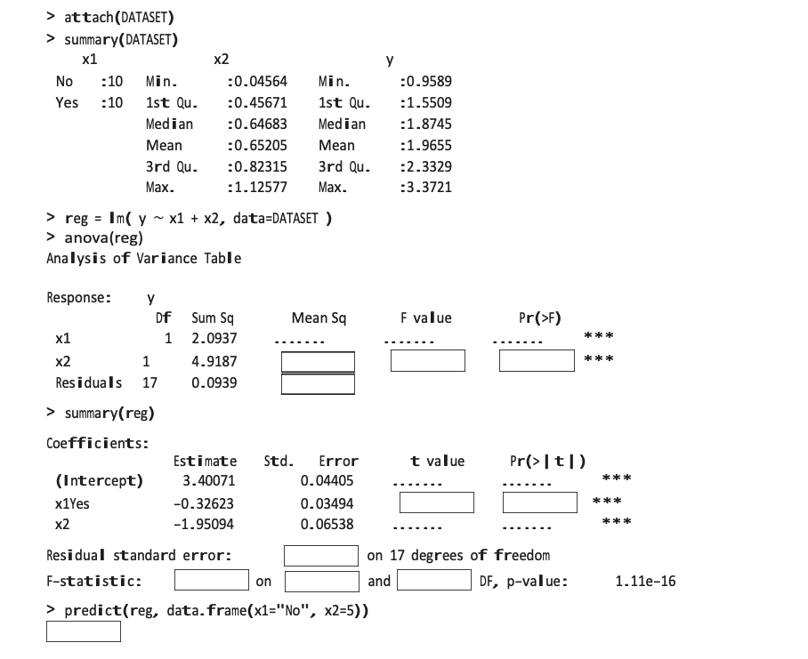
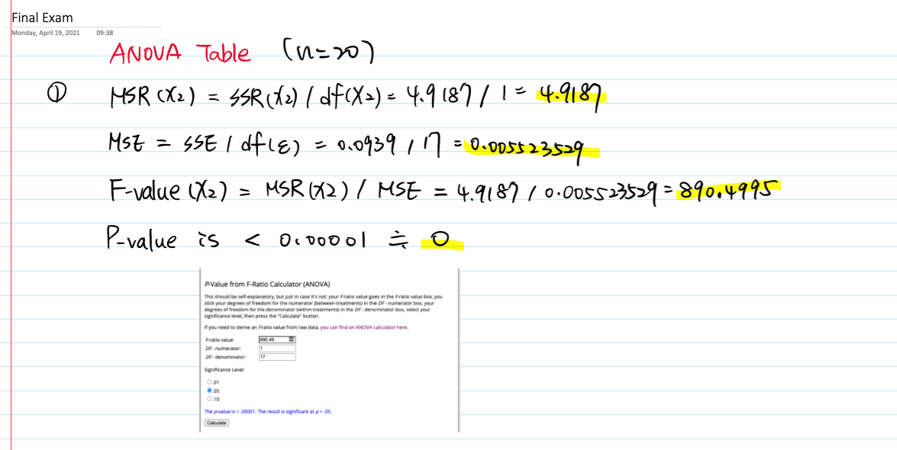
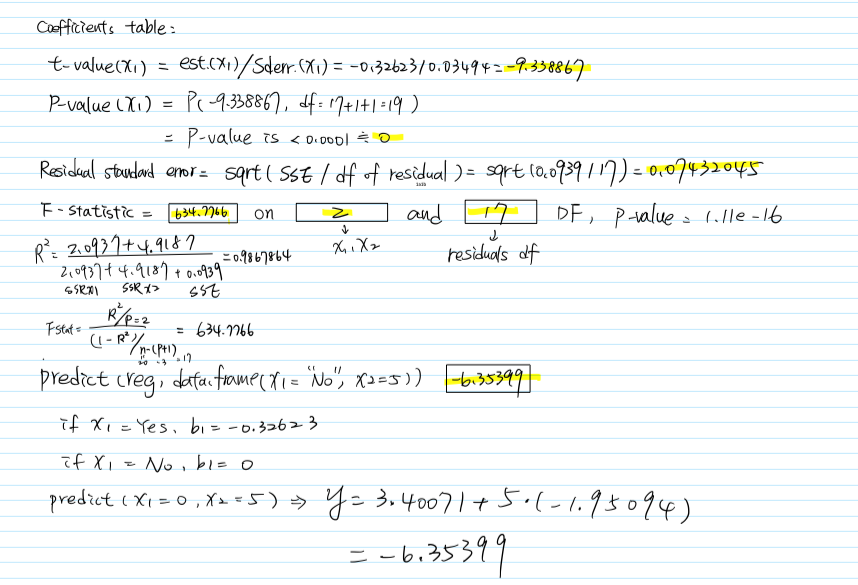
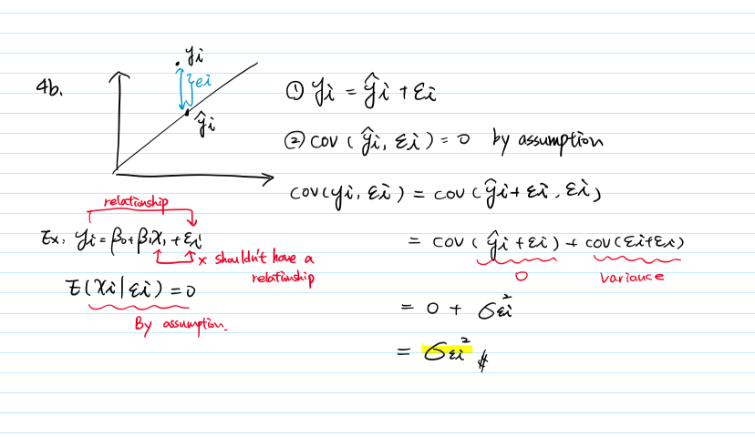

```{r setup, include=FALSE}
knitr::opts_chunk$set(echo = TRUE)
library(tidyverse)
library(car)
```

1. (22 points) (By hand)
The following R code was written to study relation between variables y, x1, and x2. Unfortunately, coffee was spilled on the output, and some parts of it became unreadable. Restore the missing parts in the 11 empty boxes.







# References
- P-Value from F-Ratio Calculator: https://www.socscistatistics.com/pvalues/fdistribution.aspx
- P Value from T Score Calculator: https://www.socscistatistics.com/pvalues/tdistribution.aspx

2. (16 points) Multiple linear regression models are studied for eight different sets of data. Below are various kinds of residual plots. For each case, give a brief diagnostics of the regression model and suggest a way to improve the model, if necessary.

Heteroscedasticity occurs when the variance for all observations in a data set are not the same. 
it is a violation of the ordinary least square assumption that $var(yi)=var(ei)=variance2$. In the presence of heteroskedasticity, there are two main consequences on the least squares estimators:

(a) The least squares estimator is still a linear and unbiased estimator, but it is no longer best. That is, there is another estimator with a smaller variance.

(b) The standard errors computed for the least squares estimators are incorrect. This can affect confidence intervals and hypothesis testing that use those standard errors, which could lead to misleading conclusions.

Models with linear pattern and constant variance (no need to improve): 1, 2, 6, 8

**Plot 3:** Problems: nonlinearity and heterogeneity. However, there is a non-random pattern just not linear (U-shaped). It suggests that this model can be tested on a quadratic model for a better fit.

**Plot 4:** Non constant variance and it seems like the data is divided. We could transform the data such as taking logs and sqrt and see if there’s improvement.

**Plot 5:** Problems: Nonlinearity and heteroscedasticity. We could transform the variables to improve the model such as taking logs and sqrt.

**Plot 7:** The “fan out” shape suggests heteroscedasticity. We could transform the data like taking logs and sqrt to improve the model. We could also use a Weighted Least Square model to address this issue.


3. (32 points) (Use R for data analysis)
Based on our known “mtcars” dataset, we’ll now build a model for predicting variable `qsec`, the time in seconds that it takes a car to drive 1/4 mile from a full stop.
```{r}
str(mtcars)
#mtcars$cyl <- as.factor(mtcars$cyl)
#mtcars$vs <- as.factor(mtcars$vs)
#mtcars$am <- as.factor(mtcars$am)
# levels(mtcars$am) <- c("automatic", "manual")
#mtcars$gear <- as.factor(mtcars$gear)
#mtcars$carb <- as.factor(mtcars$carb)
```

(a) Select the **optimal** subset of independent variables for the prediction of the `qsec` using your favorite variable selection method. Show all methods used and justify your conclusion.

# Exhaustive Search
```{r}
library(leaps)
best <-  regsubsets(qsec ~ ., data = mtcars)
summary(best)
```

## Find out the largest adjusted R squares
- $R^2$ is not a fair measurement. As the number of parameters increases, so does the $R^2$.
```{r}
summary(best)$adjr2
which.max(summary(best)$adjr2)
```

## Find out the smallest Mallows Cp
```{r}
summary(best)$cp
which.min(summary(best)$cp)
```

## Find out the smallest BIC (penalized-likelihood criteria)
```{r}
summary(best)$bic
which.min(summary(best)$bic)
```
# Sequential Search
- Lower AIC (Akaike information criterion) values indicate a better-fit model
```{r}
reg.null = lm(qsec ~ 1, data = mtcars)
reg.full = lm(qsec ~ ., data = mtcars)

# using algorithm to considers either adding or removing variables at each step:
step(reg.null, scope=list(lower=reg.null, upper=reg.full ), direction = "forward")

```

# Conclusion
Our final mission is to select the **fewest** predictors in the linear model. In exhaustive search, the adjusted R squares suggests we use 7 variables, the Mallows Cp and BIC suggest 4 variables. In sequential search, we use algorithm to considers either adding or removing variables at each step to final the best model. The lowest AIC = -11.08, suggesting the best model use 6 variables. Therefore, we consider choosing 4 variables' model from Mallows Cp and BIC methods so the best predictors of `qesc` is `disp`, `wt`, `vs`, and `carb`. 

According to the coefficient table, all 4 independent variables are completely significant, and the adjusted R-squared is 0.82, meaning that the linear model is a good to predict `qsec`.
```{r}
# the best model
reg <- lm(qsec ~ disp + wt + vs + carb, data = mtcars)
summary(reg)
```

# Regression Equation
$$
\hat{qsec} = 15.584969 - 0.012291disp + 1.895087wt + 1.469469vs -0.583230carb
$$

(b) Is there any indication of nonlinear relations? Explain how you reach this conclusion.

- **Plot:**: Based on the left top `residuals vs fitted` plot, the red line looks horizontal, meaning that this model may not indicate nonlinear relationships. 
- **Table**: Check the inversely related values of Tolerance and VIF. **Tolerance has to be > 0.10 and VIF < 10.** If these stipulated are not fulfilled, multicollinearity is at hand. A correction table reveals `cyl`, `disp`, `hp` and `wt` are highly correlated with each another, meaning that there might be a cause for the multicollinearity problem.

```{r}
library(performance)
mtcarsReg <- lm(qsec ~., data = mtcars)
par(mfrow=c(2,2))
plot(mtcarsReg)
check_collinearity(mtcarsReg)
```

(c) Test significance of interaction between the weight (wt) and transmission (am, 0 = automatic, 1 = manual). (Hint: Use the “best” model according to part (a)).
- Let us take a look on interaction term `wt:am`, the p-value is 0.745148 which is not significant. Compared to model 3a, adding a transmission variable (`am`) is not good to explain the response variable so we consider removing interaction term. 
```{r}
# Add interaction into the model
intercationReg <- lm(qsec ~ disp + wt * am + vs + carb, data = mtcars)
summary(intercationReg)$coefficients[7,]
```

(d) (**only for 615 students**) Construct a 90% prediction interval for `qsec` of a car that has 6 cylinders (`cyl`) and 150 horsepower (`hp`).

- When cylinders = 6 and horsepower = 150, a 90 % prediction interval for drive 1/4 mile from a full stop (`qsec`) is [15.53595, 20.04211].
```{r}
cylAndHp <- lm(qsec ~ cyl + hp, data = mtcars)
# summary(cylAndHp)

predict(cylAndHp, dplyr::tibble(cyl = 6, hp = 150), interval = "prediction", level = 0.90)
```


4. (10 points) (By hand)
A student fitted a linear regression function for a class assignment. The student plotted the residuals $ei$ against responses $Yi$ and found positive relation. When the residuals were plotted against the fitted values $\hat{Yi}$, the student found no relation.
(a) How could the differences arise? Which is the more meaningful plot?

There is a relation between $ei$ against $Yi$ because $ei$ can be found as $Yi - \hat{Y}i$. Plus, $ei$ is dependent of $Yi$ so we can see $ei$ has a positive relation with $Yi$ on the plot. In contract, there is no relation between the $ei$ and $\hat{Y}i$ because as I mentioned that $ei = Yi - \hat{Y}i$ so $ei$ is independent of $\hat{Y}i$. In conclusion, $ei$ vs $Yi$ is the more meaningful plot.
 
(b) Support your answer by deriving the sample covariance $Cov(ei, Yi)$ and $Cov(ei, \hat{Yi})$. Feel free to use any Formula and any results that we derived in class.

Recall, the OLS assumptions are below:

- The linear regression model is “linear in parameters.”
- There is a random sampling of observations.
- The conditional mean should be zero.
- There is no multi-collinearity (or perfect collinearity).
- Spherical errors: There is homoscedasticity and no autocorrelation
- Optional Assumption: Error terms should be normally distributed.

Then, we start to derive the covariance between $ei$, $Yi$ and $ei$, $\hat{Yi}$:



## References
- https://www.albert.io/blog/key-assumptions-of-ols-econometrics-review/
- https://stats.stackexchange.com/questions/155587/residual-plots-why-plot-versus-fitted-values-not-observed-y-values

5. (25 points) (Use R for data analysis)
An experiment was conducted to evaluate the effect of vitamin C on tooth growth. Sixty guinea pigs received
various doses of vitamin C by one of two delivery methods, orange juice or ascorbic acid. Results of this
experiment are in dataset ‘‘ToothGrowth’’ which is already loaded in R. You can look at it with commands
`attach(ToothGrowth), names(ToothGrowth), summary(ToothGrowth), ToothGrowth.`\
The data set contains the following variables:

- `len`: Tooth length
- `supp`: supplement or delivery method (OJ = orange juice, VC = ascorbic acid)
- `dose`: Dose in milligrams/day

## Read the data
Because `supp` is a dummy variable, so we can recode the observations: set `VC (ascorbic acid)` as **1** and set `OJ (orange juice)` as **0**.
```{r}
ToothGrowth %>%
  mutate(supp = dplyr::recode(supp, "VC" = 1, "OJ" = 0)) -> ToothGrowthDummy
```

(a) Fit a linear regression model that can be used to predict the tooth length based on the dose and the
delivery method of vitamin C.
```{r}
toothReg <- lm(len ~ ., data = ToothGrowthDummy)
summary(toothReg)
```

## Model Equation
The expected value of tooth length is:

$$
\hat{len} = 9.2725 - 3.7000supp + 9.7636dose
$$

(b) Is delivery method significant?
- The p-value of delivery method (`supp`) is 0.0013, meaning that there is evidence that the `supp` is significant, in addition to X2 (`dose`) that is already in the model. In other words, we can have evidence to reject the null (H0: $\beta_1$ = 0 can be rejected). 

```{r}
summary(toothReg)
```

(c) Is there a significant interaction between the dose and the delivery method, at $\alpha$ = 5% level?
- The interaction term has a p-value of 0.024631, indicating that it is significant.
```{r}
toothRegInteraction <- lm(len ~ supp * dose, data = ToothGrowthDummy)
summary(toothRegInteraction)
```

(d) Write two regression equations explicitly, one equation for each delivery method.
- If `supp`(X1) = 1, meaning that the delivery method is ascorbic acid (VC), the following regression equation is: 

$$
\hat{len} = 11.550 - 8.255 + 7.811dose + 3.904dose
$$
Then: 
$$
\hat{len} = 3.295 + 11.715dose
$$

- If `supp`(X1) = 0, meaning that the delivery method is orange juice (OJ), the following regression equation is: 

$$
\hat{len} = 11.550 + 7.811dose
$$

(e) What percent of the total variation of the tooth length is explained by this regression?
- We have 72.9 % of the total variation of the tooth length is explained by the predictors. 
```{r}
summary(toothRegInteraction)$r.square
# summary(toothRegInteraction)$adj.r
```

