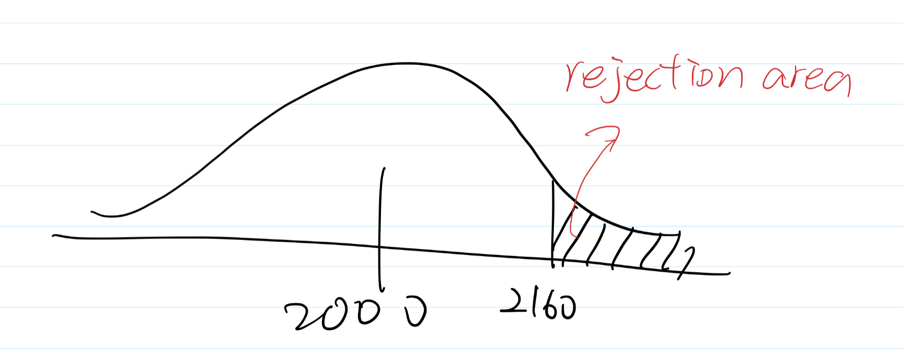
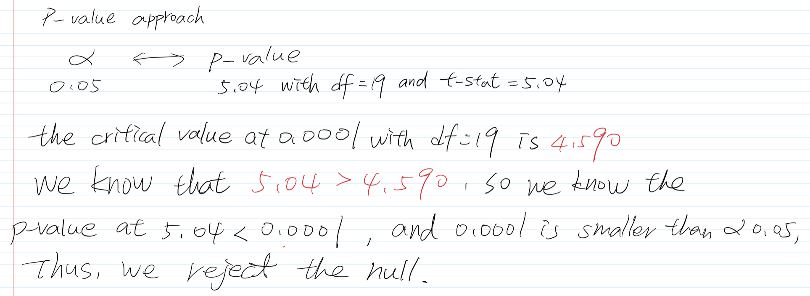
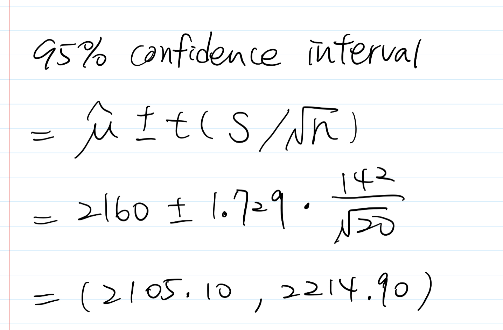
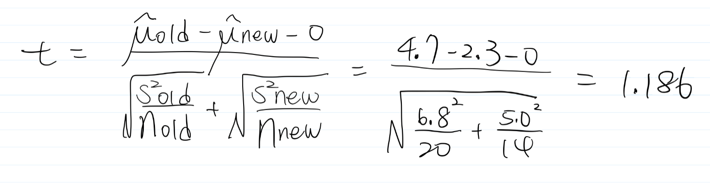
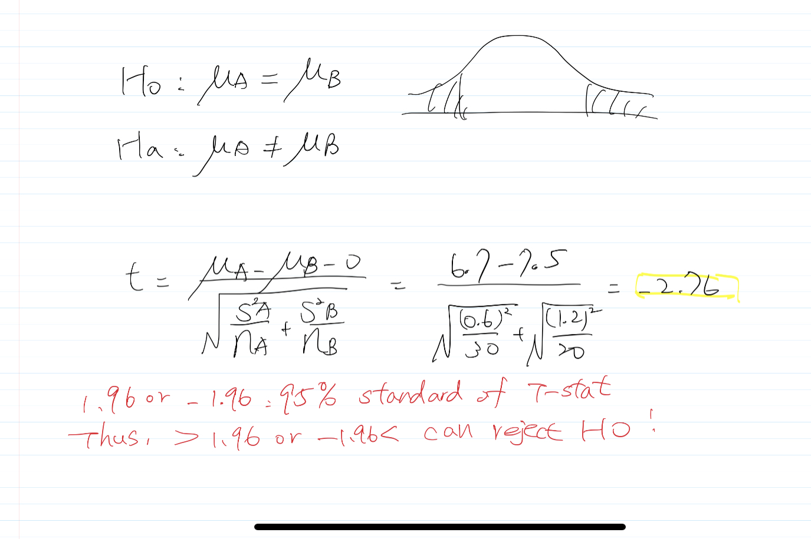

```{r setup, include=FALSE}
knitr::opts_chunk$set(echo = TRUE)
```

## Review of Estimation and Hypothesis Testing (handouts, your old notes, ...)
When $\alpha$ is not given, use the p-value approach to make your conclusions. When it’s difficult to conclude, use $\alpha$ = 0.05. For two-sample problems, use the F-test to decide which t-test to use.\

1. The manufacturer of a certain brand of household light bulbs claims that the bulbs produced by his factory have an average life of at least 2,000 hours. The mean and standard deviation of 20 light bulbs selected from the manufacturer’s production process were calculated to be 2,160 and 142 hours, respectively.

(a) Do the data represent sufficient evidence to support the manufacturer’s claim? How can you interpret your answer?


- Let we set H0: mu < 2000, and Ha: mu >= 2000. Note, this is a one-sided t-test with $\alpha$ = 0.05, and degree of freedom: n-1 = 20-1 = 19. According to the information given, the sample mean is 2160, and the sample standard deviation is 142. We use t-statistics to conduct the statistical inference.

- The critical value for $\alpha$ = 0.05 at df = 19 is 1.729 according to the t-distribution table. As 5.04 > 1.729, so we reject the null and claim that we have sufficient evidence to support the manufacturer's claim with a 5 % probability that I am going to reject the null when it is true.

**p-value approach**




(b) Construct a 95% confidence interval for the mean lifetime of household light bulbs.



2. There are two manufacturing processes, old and new, that produce the same product. The defect rate has been measured for 20 days for the old process, and for 14 days for the new process, resulting in the following sample summaries.

The firm is interested in switching to the new process only if it can be demonstrated convincingly that the new process reduces the defect rate. Is there significant evidence of that? Use $\alpha$ = 5%; assume that the collected data represent two random samples from Normal distributions. Use the method of testing that is appropriate for this situation.

- This is a one-sided t-test for the difference in mean. As the question mentioned, the new process of manufacturing 
can reduces the defect rate so Ho: muNEW = muOLD; Ha: muNEW - muOLD < 0.



- Since the collected data represent two random samples from normal distributions, we are able to use t-test at  $\alpha$ = 0.05. The critical value for $\alpha$ = 0.05 is 1.694. 1.186 < 1.694, so there is no evidence to support the claim.

3. (Required for Stat-615, optional for Stat-415) An account on server A is more expensive than an account on server B. However, server A is faster. To see if whether it’s optimal to go with the faster but more expensive server, a manager needs to know how much faster it is. A certain computer algorithm is executed 30 times on server A and 20 times on server B with the following results,
(a) Is there a significant difference between the two servers?
- we use two-sided t-procedure, and the answer to this is Server A and Server B is a significant difference.



(b) Is server A significantly faster?


4. Micro-project. Data on 522 recent home sales are available on our Blackboard web site The following variables are included.\
Use software to find out if there is significant evidence that:\
```{r}
# read the dataset
library(tidyverse)
homeSales <- read_csv("./data/HOME_SALES(1).csv")
```


(a) The sales price depends on the air conditioner in the house.\
- In the two-sided t-procedure, the small p-value < 2.2e-16 is reject the null hypothesis. That is, there is significant evidence exists that the sales price depends on the air conditioner in the house.
```{r}
# use the two-sided t.test function in R
toutA <- t.test(x = homeSales$SALES_PRICE[homeSales$AIR_CONDITIONER == "YES"], 
                y = homeSales$SALES_PRICE[homeSales$AIR_CONDITIONER == "NO"], 
                alternative = "two.sided")

toutA
```

(b) On the average, homes with an air conditioner are more expensive.\
- H0: muAC = muNOAC, Ha: muAC > muNOAC.
- With 95 % confidence interval, the one-sided small p-value for a test of the distribution of air conditioner house being shifted higher 106.2176 thousand dollars (295.8006-189.5830) than the distribution of no air conditioner house, respectively.
```{r}
# use the one-sided t.test function in R
toutB <- t.test(x = homeSales$SALES_PRICE[homeSales$AIR_CONDITIONER == "YES"], 
                y = homeSales$SALES_PRICE[homeSales$AIR_CONDITIONER == "NO"], 
                alternative = "greater")
toutB
```
(c) On the average, homes with an air conditioner are larger.\
- Based on the result, the p-value is 4.817e-13, so we have evidence to reject the null hypothesis. The house have ac is 2346.339 sqft, which is larger than the house have no AC (1837.909 sqft) with 95 % confidence interval, on average.
```{r}
# use the one-sided t.test function in R
toutC <- t.test(x = homeSales$FINISHED_AREA[homeSales$AIR_CONDITIONER == "YES"], 
                y = homeSales$FINISHED_AREA[homeSales$AIR_CONDITIONER == "NO"], 
                alternative = "greater")
toutC
```

(d) The sales price depends on the proximity to a highway.\
- With a large p-value of 0.09011, we do not have sufficient evidence to conclude that the sales price and its proximity to highway have an association.
```{r}
# use the two-sided t.test function in R
toutD <- t.test(x = homeSales$SALES_PRICE[homeSales$HIGHWAY == "YES"], 
                y = homeSales$SALES_PRICE[homeSales$HIGHWAY == "NO"], 
                alternative = "two.sided")

toutD
```

(e) On the average, homes are cheaper when they are close to a highway.\
- The small p-value 0.04506 explains that the house is close to a highway is 230.0273 thousand dollars; the house is not close to a highway is 278.9245 thousand dollars. Thus, the sales price of residence of living next to a highway is cheaper 48897.2 dollars than not living next to a highway with 95 % CI, on average.
```{r}
# use the one-sided t.test function in R
toutE <- t.test(x = homeSales$SALES_PRICE[homeSales$HIGHWAY == "YES"], 
                y = homeSales$SALES_PRICE[homeSales$HIGHWAY == "NO"], 
                alternative = "less")

toutE
```


(f) On the average, homes are cheaper when they are far from a highway.\
-  With this large p-value 0.9549 we conclude there is no evidence to reject the null hypothesis. That is, we cannot conclude that the sales price of homes are cheaper when they are far from a highway.
```{r}
# use the one-sided t.test function in R
toutF <- t.test(x = homeSales$SALES_PRICE[homeSales$HIGHWAY == "YES"], 
                y = homeSales$SALES_PRICE[homeSales$HIGHWAY == "NO"], 
                alternative = "greater")

toutF
```

Fortunately, I did a similar data EDA project with R Shiny APP for the STAT-613 class, please refer to [**this**](https://twyunting.shinyapps.io/estate/) for more details.