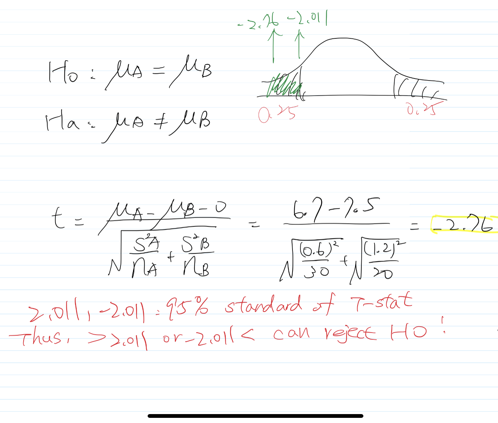

```{r setup, include=FALSE}
knitr::opts_chunk$set(echo = TRUE)
```

## Review of Estimation and Hypothesis Testing (handouts, your old notes, ...)
When $\alpha$ is not given, use the p-value approach to make your conclusions. When it’s difficult to conclude, use $\alpha$ = 0.05. For two-sample problems, use the F-test to decide which t-test to use.\

1. The manufacturer of a certain brand of household light bulbs claims that the bulbs produced by his factory have an average life of at least 2,000 hours. The mean and standard deviation of 20 light bulbs selected from the manufacturer’s production process were calculated to be 2,160 and 142 hours, respectively.

(a) Do the data represent sufficient evidence to support the manufacturer’s claim? How can you interpret your answer?


- For this question, I will be using the One Sample T-test because it tests the mean of a single group against a known mean. In this question, 2160 is the mean of 20 selected light bulb and 2000 is the known population mean. I am not using Z-score because it requires the known information on the population mean, population standard deviation, the sample mean and the sample size. I don’t have any information on the population standard deviation; therefore I chose T-test.
- Let we set H0: mu < 2000 (Which means the average life of the light bulbs produced by the factory is less than 2000 hours), and Ha: mu >= 2000 (Manufacturer’s claim: Which means the average life of the light bulbs produced in the factory is at least 2000 hours). Note, this is a one-sided t-test with $\alpha$ = 0.05, and degree of freedom: n-1 = 20-1 = 19. According to the information given, the sample mean is 2160, and the sample standard deviation is 142. We use t-statistics to conduct the statistical inference.

**T-stat approach:**
- The critical value for $\alpha$ = 0.05 at df = 19 is 1.729 according to the t-distribution table. As 5.04 > 1.729, meaning that the sample mean (2160) falls into the rejection area. Therefore, we will reject the null in favor of the manufacturer’s claim.

**P-value approach::**
- Since our t-stat is 5.04. With 19 degrees of freedom, we know that the p-value for a significance level of 0.0001 is 4.590. Therefore, we know that the p-value for 5.04 is even smaller than 0.0001, which confirms the rejection of the null in favor of the manufacturer’s claim.


(b) Construct a 95% confidence interval for the mean lifetime of household light bulbs.


2. There are two manufacturing processes, old and new, that produce the same product. The defect rate has been measured for 20 days for the old process, and for 14 days for the new process, resulting in the following sample summaries.

The firm is interested in switching to the new process only if it can be demonstrated convincingly that the new process reduces the defect rate. Is there significant evidence of that? Use $\alpha$ = 5%; assume that the collected data represent two random samples from Normal distributions. Use the method of testing that is appropriate for this situation.

- We will use an unpaired t-test for this question because it is used to compare two population means. We chose t-test because we know that these two samples are from normal distributions, but the parameters are unknown.According to the information given, we can test the below hypothesis:
- Ho: muOLD - muNEW <= 0 (Which means that the new process does not reduce the defect rate)
- Ha: muOLD - muNEW > 0 (Which means that the new process reduces the defect rate. That is, switching to the new process)
- Because the two samples have different variances, we use the below formula to calculate the test statistics, this gives us a t-stat of 1.186.


- Degrees of freedom = nOLD + nNEW – 2 = 20 + 14 – 2 = 32
- With an $\alpha$ = 0.05 and d.f. = 32, we know that the critical value is 1.694 (Table of T-Distribution). Because our t-stat is smaller than the critical value, meaning that we fail to reject the null, there is no significant evidence to claim that the new process reduces the defect rate. Thus, 1.186 < 1.694, so there is no evidence to support the claim.
```{r}
# p: The significance level to use
# df: The degrees of freedom
# lower.tail: If TRUE, the probability to the left of p in the t distribution is returned. 
#             If FALSE, the probability to the right is returned. Default is TRUE.
qt(0.05, 32, lower.tail = FALSE)
```

3. (Required for Stat-615, optional for Stat-415) An account on server A is more expensive than an account on server B. However, server A is faster. To see if whether it’s optimal to go with the faster but more expensive server, a manager needs to know how much faster it is. A certain computer algorithm is executed 30 times on server A and 20 times on server B with the following results,
(a) Is there a significant difference between the two servers?
- We will use a two-sided unpaired t-test for this question because it is used to compared two population means. According to the information given, we can test the below hypothesis:
- H0: muA - muB = 0 (Which means that there is no difference between two servers)
- Ha: muA - muB != 0 (Which means that the two servers are different from each other)
- Because the two samples have different variances, we use the t statistics. This gives us a t-stat of -2.76
- Degrees of freedom = nA + nB – 2 = 48. As this question is two-sided test, so we focus on 0.025 for left tail as critical value.
- The critical value for an $\alpha$ = 0.05 is -1.96. Since -2.76 < [-2.011](https://www.itl.nist.gov/div898/handbook/eda/section3/eda3672.htm), the t-stat is within the rejection area. Therefore we reject the null showing that the two servers are different.



(b) Is server A significantly faster?
- We still use an unpaired t-test but it is one-sided with a slight different hypothesis testing. 
- H0: muA - muB >= 0 (Which means server A is no faster than server B)
- Ha: muA - muB < 0 (Which means server A is faster than server B)
- The t-stat is still -2.76 as calculated in part a. The critical value for a one-sided t-test with a 5% $\alpha$ is -1.677 of 48 degrees of freedom. Since -2.76 < -[1.677](https://www.itl.nist.gov/div898/handbook/eda/section3/eda3672.htm) meaning that we reject the null and claim that server A is significantly faster. 

4. Micro-project. Data on 522 recent home sales are available on our Blackboard web site The following variables are included.\
Use software to find out if there is significant evidence that:\
```{r}
# read the dataset
library(tidyverse)
homeSales <- read_csv("./data/HOME_SALES(1).csv")
```

(a) The sales price depends on the air conditioner in the house.\

### For two-sample problems, use the F-test to decide which t-test to 

- We will use the unequal variance for t-test as the p-value is 1.017e-11.
```{r}
attach(homeSales)
var.test(x=SALES_PRICE[AIR_CONDITIONER == "YES"], y = SALES_PRICE[AIR_CONDITIONER == "NO"])
```

- In the two-sided t-procedure, the small p-value < 2.2e-16 is reject the null hypothesis. The difference between mean prices included and excluded an AC has 95 % confidence limits 85.9 and 126.5 thousand dollars. That is, there is significant evidence exists that the sales price depends on the air conditioner in the house.

```{r}
# use the two-sided t.test function in R
toutA <- t.test(x = homeSales$SALES_PRICE[homeSales$AIR_CONDITIONER == "YES"], 
                y = homeSales$SALES_PRICE[homeSales$AIR_CONDITIONER == "NO"], 
                alternative = "two.sided")

toutA
```

(b) On the average, homes with an air conditioner are more expensive.\
- H0: muAC = muNOAC, Ha: muAC > muNOAC.
- With 95 % confidence interval, the one-sided small p-value for a test of the distribution of air conditioner house being shifted higher 106.2176 thousand dollars (295.8006-189.5830) than the distribution of no air conditioner house, respectively.
```{r}
# use the one-sided t.test function in R
toutB <- t.test(x = homeSales$SALES_PRICE[homeSales$AIR_CONDITIONER == "YES"], 
                y = homeSales$SALES_PRICE[homeSales$AIR_CONDITIONER == "NO"], 
                alternative = "greater")
toutB
```
(c) On the average, homes with an air conditioner are larger.\
- Based on the result, the p-value is 4.817e-13, so we have evidence to reject the null hypothesis. The house have ac is 2346.339 sqft, which is larger than the house have no AC (1837.909 sqft) with 95 % confidence interval, on average.
```{r}
# use the one-sided t.test function in R
toutC <- t.test(x = homeSales$FINISHED_AREA[homeSales$AIR_CONDITIONER == "YES"], 
                y = homeSales$FINISHED_AREA[homeSales$AIR_CONDITIONER == "NO"], 
                alternative = "greater")
toutC
```

(d) The sales price depends on the proximity to a highway.\

### For two-sample problems, use the F-test to decide which t-test to use
- With the large p-value 0.08588, meaning that there is no evidence of different variances. Thus, we can constantly using t-test.

```{r}
attach(homeSales)
var.test(x=SALES_PRICE[HIGHWAY == "YES"], y=SALES_PRICE[HIGHWAY == "NO"])
```

- With a large p-value of 0.09011, we do not have sufficient evidence to conclude that the sales price and its proximity to highway have an association.
```{r}
# use the two-sided t.test function in R
toutD <- t.test(x = homeSales$SALES_PRICE[homeSales$HIGHWAY == "YES"], 
                y = homeSales$SALES_PRICE[homeSales$HIGHWAY == "NO"], 
                alternative = "two.sided")

toutD
```

(e) On the average, homes are cheaper when they are close to a highway.\
- The small p-value 0.04506 explains that the mean of house is close to a highway is 230.0273 thousand dollars; the mean of house is not close to a highway is 278.9245 thousand dollars. Thus, the sales price of residence of living next to a highway is cheaper 48897.2 dollars than not living next to a highway with 95 % CI, on average.
```{r}
# use the one-sided t.test function in R
toutE <- t.test(x = homeSales$SALES_PRICE[homeSales$HIGHWAY == "YES"], 
                y = homeSales$SALES_PRICE[homeSales$HIGHWAY == "NO"], 
                alternative = "less")

toutE
```


(f) On the average, homes are cheaper when they are far from a highway.\
-  With this large p-value 0.9549 we conclude there is no evidence to reject the null hypothesis. That is, we cannot conclude that the sales price of homes are cheaper when they are far from a highway.
```{r}
# use the one-sided t.test function in R
toutF <- t.test(x = homeSales$SALES_PRICE[homeSales$HIGHWAY == "YES"], 
                y = homeSales$SALES_PRICE[homeSales$HIGHWAY == "NO"], 
                alternative = "greater")

toutF
```

Fortunately, I did a similar data EDA project with R Shiny APP for the STAT-613 class, please refer to [**this**](https://twyunting.shinyapps.io/estate/) for more details.