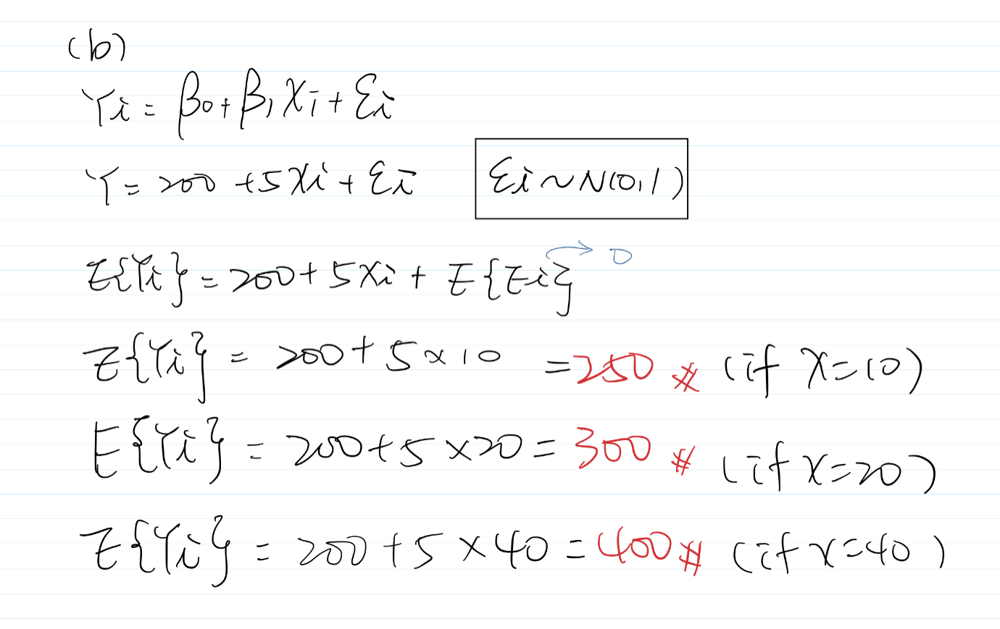

```{r setup, include=FALSE}
knitr::opts_chunk$set(echo = TRUE)
```

1. (**1.2**) The members of a health spa pay annual membership dues of $\$$300 plus a charge of $\$$2 for each visit to the spa. Let Y denote the dollar cost for the year for a member and X the number of visits by the member during the year. Express the relation between X and Y mathematically. Is it a functional relation or a statistical relation (that is, is the relation deterministic or stochastic)?

- deterministic: the output of the model is entirely determined by the values of the parameters and the initial conditions; stochastic: random, unpredictable.
- The association between X and Y is: Y = 300 + 2X (dollars).\
This is a functional relationship because a effect in the value of the X will cause the corresponding change in the value of the Y. X and Y will not have a uncertain effect.

2. (**1.6**) Suppose the regression parameters are $\beta0$ = 200 and $\beta1$ = 5.0.\
(a) Plot the regression equation.\


(b) Predict the response for X = 10, 20, and 40.\



(c) Explain the meaning of parameters $\beta0$ and $\beta1$.\
- $\beta0$ = Y intercept of regression line.
- $\beta1$: one unit change in X, generates a $\beta1$ unit change in Y.

3. (**1.10**) An analyst in a large corporation studied the relation between current annual salary (Y ) and age (X) for the 46 computer programmers presently employed in the company. The analyst concluded that the relation is curvilinear, reaching a maximum at 47 years. Does this imply that the salary for a programmer increases until age 47 and then decreases? Explain.

- We know the relation between X and Y is **curvilinear**. It is not true because it reaches its maximum at a point and then increasing at a decreasing rate meaning that wage first increases to a max at year 47 and then the increasing rate slows down. In reality, decreasing salary as people age in any company is not make sense, we also can find a bunch of examples in real world.

4. The time it takes to transmit a file always depends on the file size. Suppose you transmitted 30 files, with the average size of 126 Kbytes and the standard deviation of 35 Kbytes. The average transmittance time was 0.04 seconds with the standard deviation of 0.01 seconds. The correlation coefficient between the time and the size was 0.86.
Based on this data, fit a linear regression model and predict the time it will take to transmit a 400 Kbyte file.


5. At a gas station, 180 drivers were asked to record the mileage of their cars and the number of miles per gallon. The results are summarized in the table.\

(a) Compute the least squares regression line which describes how the number of miles per gallon depends on the mileage.\
(b) What do the obtained slope and intercept mean in this situation?\
(c) You purchase a used car with 35,000 miles on it. Predict the number of miles per gallon.\

6. (Stat-615 only) Show that the sample intercept b0 is a linear and unbiased estimator of the population intercept $\beta0$.

7. (Computer project - 1.19, 1.24). Grade point average. The director of admissions of a small college selected 120 students at random from the new freshman class in a study to determine whether a students grade point average (GPA) at the end of the freshman year (Y) can be predicted from the ACT test score (X). The results of the study follow.\

(a) Obtain the least squares estimates of β0 and β1 and state the estimated regression function.\
(b) Plot the estimated regression function and the data. Does the estimated regression function appear to fit the data well?\
(c) Obtain a point estimate of the mean freshman GPA for students with ACT test score X = 30.\
(d) What is the point estimate of the change in the mean response when the entrance test score increases by one point?\
(e) Obtain the residuals ei and the sum of the squared residuals 􏰀 e2i .\
(f) Obtain point estimates of σ2 and σ. In what units is each of them expressed?\
```{r}
library(tidyverse)
aaa <- read_tsv("./data/CH01PR19.txt")
aaa
```

