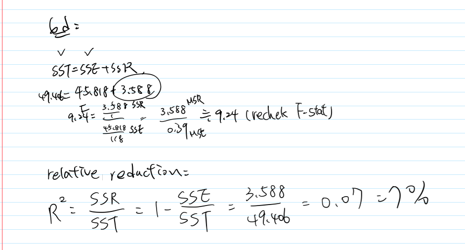
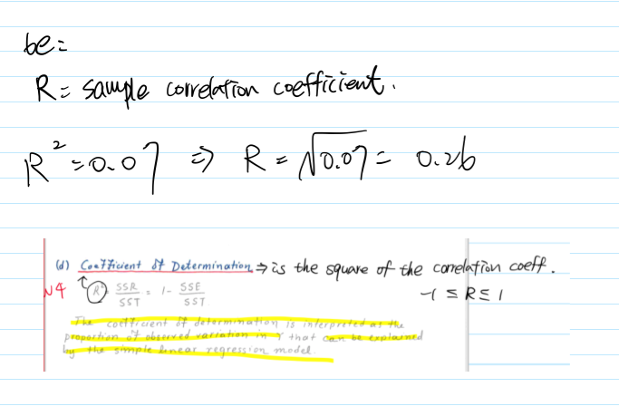

```{r setup, include=FALSE}
knitr::opts_chunk$set(echo = TRUE)
library(tidyverse)
```

1. **(2.17)** An analyst fitted normal error regression model and conducted an F test of H0 : $\beta1$ = 0
versus H1 : $\beta1$ = 0. The P-value of the test was 0.033, and the analyst concluded that $\beta1$ 6= 0.
Was the $\alpha$ level used by the analyst greater than or smaller than 0.033? If the $\alpha$ level had been 0.01, what would have been the appropriate conclusion?

The hypothesis is H0 : $\beta1$ = 0 v.s. H1 : $\beta1$ = 0. With the small p-value 0.033, we have evidence to reject the null, meaning that $\alpha$ > 0.033. If the $\alpha$ level had been 0.01 ???

2. **(2.18)** For conducting statistical tests concerning the parameter $\beta1$, why is the t-test more
versatile than the F-test?

Because t-test have one-sided test(left tail & right tail), and two-sided test for $\beta1$. Conversely, F-test (most notably in ANOVA) can only detect H0 : $\beta1$ = 0 v.s. H1 : $\beta1$ != 0.

3. **(2.19)** When testing H0 : $\beta1$ = 0 versus H1 : $\beta1$ 6= 0, why is the F-test a one-sided test even
though H1 includes both cases $\beta1$ < 0 and $\beta1$ > 0?

5. **(Continued from HW-2,3)** At a gas station, 180 drivers were asked to record the mileage of
their cars and the number of miles per gallon. The results are summarized in the table.

6. Computer project (2.23, 2.67).\
**Grade point average** (this data set was already used in Homework-2,3).
```{r}
# read the data
gpa <- read.table("./data/CH01PR19.txt")

reg <- lm(V1 ~ V2, data = gpa)
# call the regression model summary table
summary(reg)
```
(a) Set up the ANOVA table. Use it to answer questions (b-e).
```{r}
anova(reg)
```
(b) (Stat-615 only) What is estimated by MSR in your ANOVA table? by MSE? Under what conditions do MSR and MSE estimate the same quantity?\

(c) Conduct an F-test of whether or not $\beta1$ = 0. Control the $\alpha$ level at 0.01. State the
alternative and your conclusion

The F-test is 9.2402, and the p-value falls into significant level between 0.001 to 0.01. We can conclude the null hypothesis can be rejected at level 0.01 in favor of the alternative hypothesis.

(d) How much does the variation of Y reduce when X is introduced into the regression model? What is the relative reduction?

SST = 49.406, SSE = 45.818, SSR = 3.588. The coefficient of determination is 7 %. It means that 7 % of total variation of GPA score is explained by the ACT score.





(e) Obtain the sample correlation coefficient and attach the appropriate sign to it, positive or negative.

Firstly, $\beta1$ is 0.03883, which is positive slope so the correlation coefficient is a positive number. Thus, the sample correlation coefficient is 0.26.




(f) (leftover from the last homework) On the same graph, plot

  • the data
  • the least squares regression line for ACT scores
  • the 95 percent confidence band for the true regression line for ACT scores between 20 and 30.
```{r}
attach(gpa)
n = length(V2) #sample sizes
e = reg$residuals # residuals
s = sqrt(sum(e^2)/(n-2)) # estimated standard deviation = root MSE
s
W = sqrt(qf(0.95,2,n-2))  # quantity of F-distribution
W
Yhat = fitted.values(reg) # Yhat = b0 + b1x = predict(reg)
Sxx = (n-1)*var(V2) 

margin = W*s*sqrt(1/n + (V2 - mean(V2))^2/Sxx) 
upper.band = Yhat + W*s*sqrt(1 + 1/n + (V2 - mean(V2))^2/Sxx) # 95% upper 
lower.band = Yhat - W*s*sqrt(1 + 1/n + (V2 - mean(V2))^2/Sxx) # 95% lower

plot(V2, V1, xlab = "ACT", ylab = "Y = GPA", xlim = c(20,30))
abline(reg,col="red")
lines(V2 ,upper.band,col="blue")
lines(V2 ,lower.band,col="blue")
```
