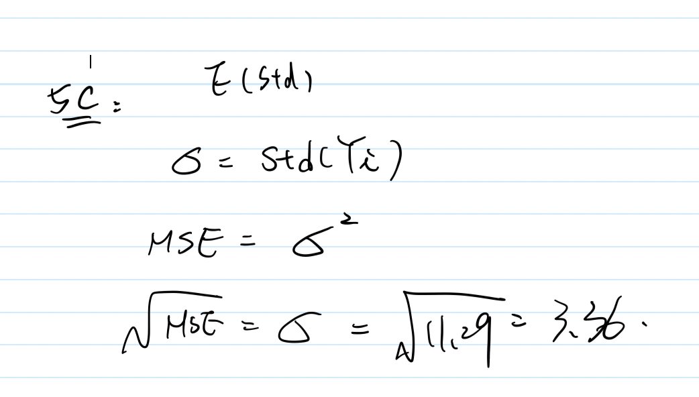

1. **(2.17)** An analyst fitted normal error regression model and conducted an F test of H0 : $\beta1$ = 0
versus H1 : $\beta1$ = 0. The P-value of the test was 0.033, and the analyst concluded that $\beta1$ = 0.
Was the $\alpha$ level used by the analyst greater than or smaller than 0.033? If the $\alpha$ level had been 0.01, what would have been the appropriate conclusion?

**An F-statistic greater than the critical value is equivalent to a p-value less than alpha and both mean that we can reject the null hypothesis.** With the small p-value 0.033, we have evidence to reject the null, meaning that $\alpha$ > 0.033. Plus, 0.033 is greater than 0.01, so we also can reject the null at $\alpha$ = 0.01.\
Reference: https://stats.stackexchange.com/questions/50727/f-statistic-f-critical-value-and-p-value

2. **(2.18)** For conducting statistical tests concerning the parameter $\beta1$, why is the t-test more
versatile than the F-test?

Because t-test has one-sided test(left tail & right tail), and two-sided test for $\beta1$. Conversely, F-test (most notably in ANOVA) only can detect H0 : $\beta1$ = 0 v.s. H1 : $\beta1$ != 0.

3. **(2.19)** When testing H0 : $\beta1$ = 0 versus H1 : $\beta1$ 6= 0, why is the F-test a one-sided test even
though H1 includes both cases $\beta1$ < 0 and $\beta1$ > 0?

The F-stat is always a number that is positive. The large values of F-stat is support Ha, and the values of F-stat approximate to 1 support H0. In other words, $\beta1^2$ > 0, which is the same as testing whether $\beta1$ > 0 or $\beta1$ < 0, respectively.


4.

5. **(Continued from HW-2,3)** At a gas station, 180 drivers were asked to record the mileage of
their cars and the number of miles per gallon. The results are summarized in the table.

The sample correlation coefficient is r = -0.17. In the previous homework, we fit a regression model that described how the number of miles per gallon depends on the mileage.

(a) Complete the ANOVA table. Include sums of squares, degrees of freedom, mean squares, and the F-statistic.


(b) What statement can be tested using this F-statistic? Calculate the p-value and state a conclusion for this ANOVA F-test.

- F-statistic is 5.3 
- Ho: $\beta1$ = 0 v.s. $\beta1$ != 0
- According to [F Distribution Tables](http://socr.ucla.edu/Applets.dir/F_Table.html), the F(1, 178) is 5.0239 with $\alpha$ at 0.025, F(1, 178) is 6.635 with $\alpha$ at 0.01. So we can know the p-value is between 0.025 to 0.01, meaning that we have evidence ($\alpha$ < 0.05) to reject the null hypothesis. Also, we can conclude that the slope is significant.

(c) From your ANOVA table, estimate the standard deviation of responses, $\sigma$ = Std(Yi).\

The unbiased estimation of standard deviation is 3.36




(d) Calculate $R^2$ and comment on the goodness of fit in this regression problem.

$R^2$ = 0.0289 is the straightforward interpretation for the model because it accounts for the 2.89% of the total variation in Miles per gallon explained by Mileage. With a low percentage of $R^2$, it doesn't look like fitness in this regression. We might be able to change another independent variable to fit the model with the dependent variable Miles per gallon.

6. Computer project (2.23, 2.67).\
**Grade point average** (this data set was already used in Homework-2,3).

```r
# read the data
gpa <- read.table("./data/CH01PR19.txt")

reg <- lm(V1 ~ V2, data = gpa)
# call the regression model summary table
summary(reg)
```

```
## 
## Call:
## lm(formula = V1 ~ V2, data = gpa)
## 
## Residuals:
##      Min       1Q   Median       3Q      Max 
## -2.74004 -0.33827  0.04062  0.44064  1.22737 
## 
## Coefficients:
##             Estimate Std. Error t value Pr(>|t|)    
## (Intercept)  2.11405    0.32089   6.588  1.3e-09 ***
## V2           0.03883    0.01277   3.040  0.00292 ** 
## ---
## Signif. codes:  0 '***' 0.001 '**' 0.01 '*' 0.05 '.' 0.1 ' ' 1
## 
## Residual standard error: 0.6231 on 118 degrees of freedom
## Multiple R-squared:  0.07262,	Adjusted R-squared:  0.06476 
## F-statistic:  9.24 on 1 and 118 DF,  p-value: 0.002917
```
(a) Set up the ANOVA table. Use it to answer questions (b-e).

```r
anova(reg)
```

```
## Analysis of Variance Table
## 
## Response: V1
##            Df Sum Sq Mean Sq F value   Pr(>F)   
## V2          1  3.588  3.5878  9.2402 0.002917 **
## Residuals 118 45.818  0.3883                    
## ---
## Signif. codes:  0 '***' 0.001 '**' 0.01 '*' 0.05 '.' 0.1 ' ' 1
```
(b) (Stat-615 only) What is estimated by MSR in your ANOVA table? by MSE? Under what conditions do MSR and MSE estimate the same quantity?\

|Source        | Sum of square | degrees of freedom  | Mean of square|
-------------|-------------|-----|-----|
|Regression      | 3.588 | 1 | 3.5878|
|Error    | 45.818      |  118 | 0.3883|
|Total |  49.406    |  119 ||

If $\beta1$ = 0, meaning that MSR and MSE estimate the same quantity. In this situation, X and Y does not have a linear association.


Reference: https://stats.stackexchange.com/questions/175437/mse-and-msr-in-regression-question

(c) Conduct an F-test of whether or not $\beta1$ = 0. Control the $\alpha$ level at 0.01. State the
alternative and your conclusion

Based on the ANOVA table above, the F-test is 9.2402, and the p-value falls into significant level between 0.001 to 0.01. We can conclude the null hypothesis can be rejected at level 0.001 <= $\alpha$ <= 0.01 in favor of the alternative hypothesis.

(d) How much does the variation of Y reduce when X is introduced into the regression model? What is the relative reduction?

SST = 49.406, SSE = 45.818, SSR = 3.588. The coefficient of determination is 7 %. It means that 7 % of total variation of GPA score is explained by the ACT score.


(e) Obtain the sample correlation coefficient and attach the appropriate sign to it, positive or negative.

Firstly, $\beta1$ is 0.03883, which is positive slope so the correlation coefficient is a positive number. Thus, the sample correlation coefficient is 0.26.


(f) (leftover from the last homework) On the same graph, plot

• the data\
• the least squares regression line for ACT scores\
• the 95 percent confidence band for the true regression line for ACT scores between 20 and 30\
  

```r
# confidence band for the entire population regression line
attach(gpa)
n = length(V2) #sample sizes
e = reg$residuals # residuals
s = sqrt(sum(e^2)/(n-2)) # estimated standard deviation = root MSE
s
```

```
## [1] 0.623125
```

```r
W = sqrt(2*qf(0.95,2,n-2))  # quantity of F-distribution
W
```

```
## [1] 2.479149
```

```r
Yhat = fitted.values(reg) # Yhat = b0 + b1x = predict(reg)
Sxx = (n-1)*var(V2) # sum of the squares of the difference between each x and its mean

margin = W*s*sqrt(1/n + (V2 - mean(V2))^2/Sxx) 
upper.band = Yhat + margin # 95% upper 
lower.band = Yhat - margin # 95% lower

plot(V2, V1, xlab = "ACT Score", ylab = "Y = fresh Year GPA", xlim = c(20,30))
abline(reg,col="red")
lines(V2 ,upper.band,col="blue")
lines(V2 ,lower.band,col="blue")
```

<!-- --> 

