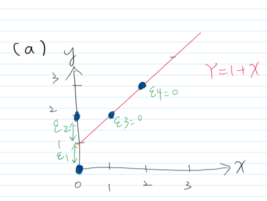
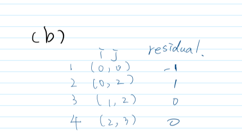
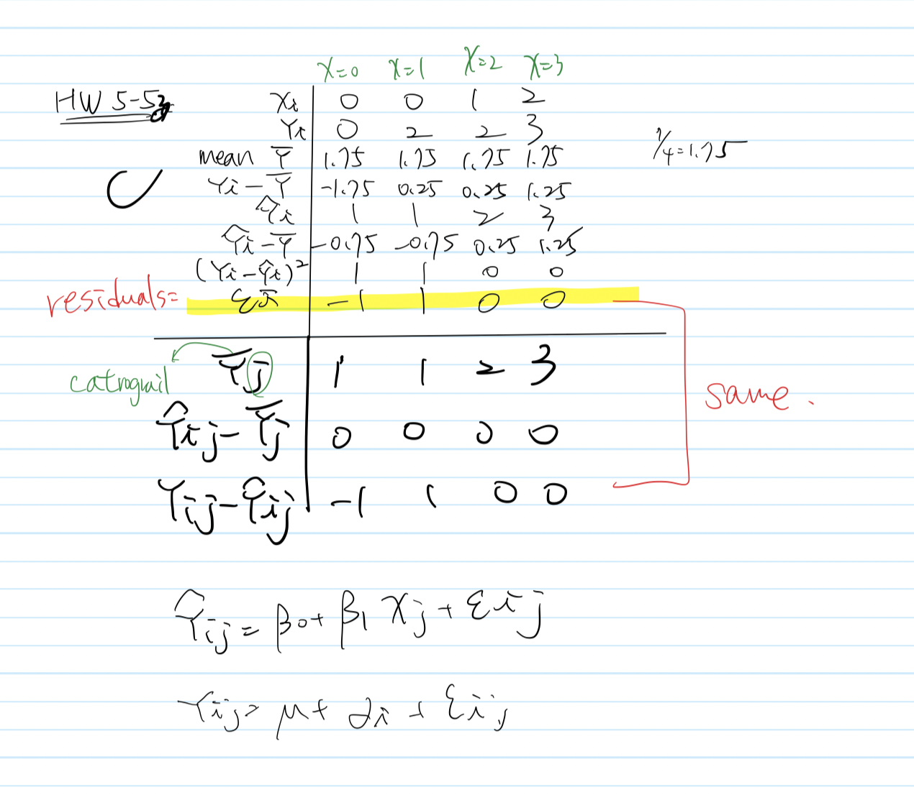
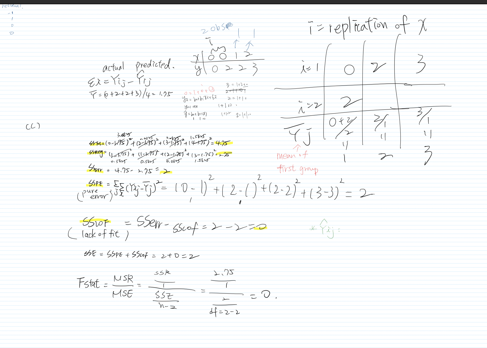

```{r setup, include=FALSE}
knitr::opts_chunk$set(echo = TRUE)
library(tidyverse)
```

1. **(3.12)** A student does not understand why the sum of squares SSPE is called a *pure error sum
of squares* “since the formula looks like the one for an ordinary sum of squares”. Explain.
- SSE = lack of fit error(SSLF) + pure error(SSPE)
- One possibility is pure error is relatively large and the linear model appears to be adequate. That is, a major part of the SSE is pure error.
- The discrepancy between the observed value and the fitted value is called the residual. The residual sum of squares (SSE) is an overall measurement of the discrepancy between the data and the estimation model. 
- The sum of squares of the residuals usually can be divided into two parts: pure error and lack of fit. The pure error sum of squares measures variation that is caused by “pure” error, meaning that this error is caused by random and there is no way to avoid this type of error in any regression analysis. However, the other component of the residual sum of squares, lack of fit, happens when the model is inappropriately fit (e.g. omitted variables, collinearity) and this can be improved statistically by choosing a better fit model.


2. **(3.19)** A student fitted a linear regression function for a class assignment. The student plotted the residuals $ei$ against responses $Yi$ and found positive relation. When the residuals were plotted against the fitted values $\hat{Y}i$, the student found no relation.

(a) How could the differences arise? Which is the more meaningful plot
- The residuals represent the distance from the $Yi$ to the $\hat{Y}i$. If there is no violation of assumptions, it should be a clear pattern when plotting residues against the Y-values that is more meaningful when performing residual analysis. Plotting $ei$ against $Yi$ is not a good choice, because it would always be a positive association between both.
- The ideal plot is the values should depart from the $\hat{Y}i$ (regression line), which is more make sense.
- Reference: http://www.stat.columbia.edu/~fwood/Teaching/w4315/Fall2010/homework_4/homework_4_solution

3. (Computer project, 3.3) Refer to the GPA data from the previous h/w assignments
```{r}
# read the data
gpa <- read.table("./data/CH01PR19.txt")
gpa %>%
  rename(GPA = V1, ACT = V2) -> gpa
```
(a) Plot residuals $ei$ against the fitted values $\hat{Y}i$. What departures from the standard regression assumptions can be detected from this plot?

To begin with, we need to know the assumptions of simple linear regression:
  1. independent observation
  2. Normally distribution
  3. Equal variances
  4. No influential outliers
  5. Linear association between (mean) y and x. That is, residual : ri = yi - yhat i.
  
Based on the studentized residuals below, we can know:
- Residuals vs Fitted: see the $\hat{Y}i$ vs $ei$. The pattern indicates linearity in the data.
- Normal QQ: There are some potential outliers in the upper extremity and lower extremity.
- Scale-Location: Testing the variance is constant or not. the data tested are not strongly constant.
- Residual vs Leverage: probably no influential observations on this plot.
```{r}
attach(gpa)
par(mfrow = c(2, 2))
reg <- lm(GPA~ACT)
plot(reg)
```

(b) Prepare a Normal Q-Q plot of the residuals and use it to comment on whether the data passes or fails the assumption of normality. Conduct the Shapiro-Wilk test for normality.
- As I mentioned, the qq plot points out there are some potential outliers in the upper extremity and lower extremity. Also, the small p-value indicates the data tested are not normality. 
```{r}
shapiro.test(rstudent(reg))
```

(c) Test whether residuals in this regression analysis have the same variance.
The p-value is 0.42397, meaning that we don't have sufficient evidence to say there is non-constant variance.
```{r}
# install.packages("car")
library(car)
ncvTest(reg)
```

(d) Conduct the lack-of-fit test and state your conclusion.
**Notice that we have a high p-value of 0.6324. So use this value to make your conclusion.**
- According to high p-value of 0.6324, we fail to reject the null, meaning that we don't have sufficient evidence of the lack-of-fit.

4. (Computer project, ) **Crime rate** data set is available on our Blackboard site.
A criminologist studies the relationship between level of education and crime rate in mediumsized U.S. counties. She collected data from a random sample of 84 counties; X is the percentage of individuals in the county having at least a high-school dipoma, and Y is the crime rate (crimes reported per 100,000 residents) last year.

## read the data first
```{r}
#col_names: describes the column names (equivalent to header in base R). It has three possible values:
#TRUE will use the the first row of data as column names.
#FALSE will number the columns sequentially.
#crime <- read_delim("./data/crimeRateData.txt", delim = " ", col_names = FALSE)
#crime

crime <- read.table("./data/crimeRateData.txt")
crime %>%
  rename(crime = V1, dipoma = V2) -> crime
```
A linear regression of Y on X is then fit to these data. Test:
(a) normal distribution of residuals

- According to Shapiro-Wilk normality test the p-value is 0.1559, meaning that we have no evidence to suggest the data are not follow a normal distribution.
```{r}
reg2 <- lm(crime ~ dipoma, data = crime)
# rstudent(reg2)
plot(rstudent(reg2))

attach(crime)
par(mfrow = c(2, 2))
plot(reg2)
shapiro.test(rstudent(reg2))
```
(b) constant variance of residuals;
- The p-value = 0.94338 indicates we fail to reject the null, meaning that data tested are not the non-constant variance. 
```{r}
ncvTest(reg2)
```
(c) presence of outliers;
- The unadjusted p-value 0.0031098 indicates no outliers.
```{r}
outlierTest(reg2)
```
(d) lack of fit.
- The difference is not significant so we have no evidence to say the linear regression model have a lack of fit (p-value is 0.8066).
```{r}
reduced <-  lm(crime ~ dipoma, data = crime) # assume linearity,
full <-  lm(crime ~ as.factor(dipoma), data = crime) # the model does NOT assume linearity
anova(reduced,full) 
```

5. For the “toy” example, consider a small data set
Try to do as much as you can by hand, without the use of a computer. The numbers are quite simple!
(a) Plot these data and draw the least squares regression line, which has the expression y = 1 + x.




(b) Compute all the residuals
- According to the 5a plot, we can find out $ei$



(c) Compute all sums of squares by hand, from their definitions:




- SSTot = 4.75
- SSReg = 2.75
- SSErr = 2
- SS pure error = 2
- SS lack of fit = 0
- SSE = SSPe + SSLof = 2 (degres of freedom = 2)
- According to [Critical F-value Calculator](https://www.danielsoper.com/statcalc/calculator.aspx?id=4), F-Table for $\alpha$ = 0.05 the F score is 19, F-Table for $\alpha$ = 0.1 the F score is 9 (df1, df2 = 2). We calculate the F score is 1 so we cannot reject the null, meaning that we have no evidence to conclude the model have a lack of fit.

