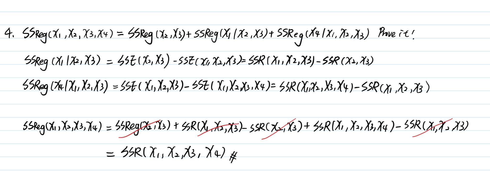
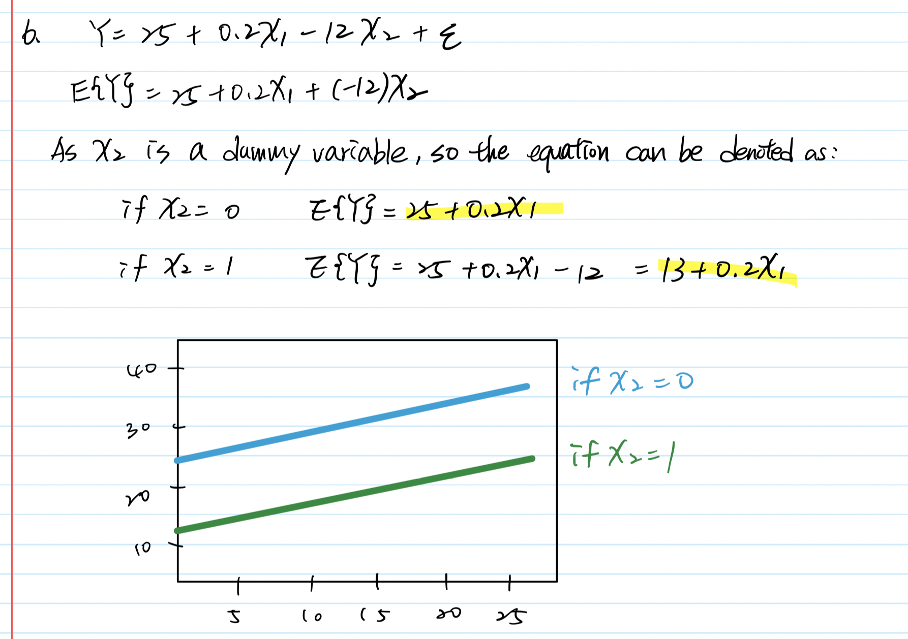
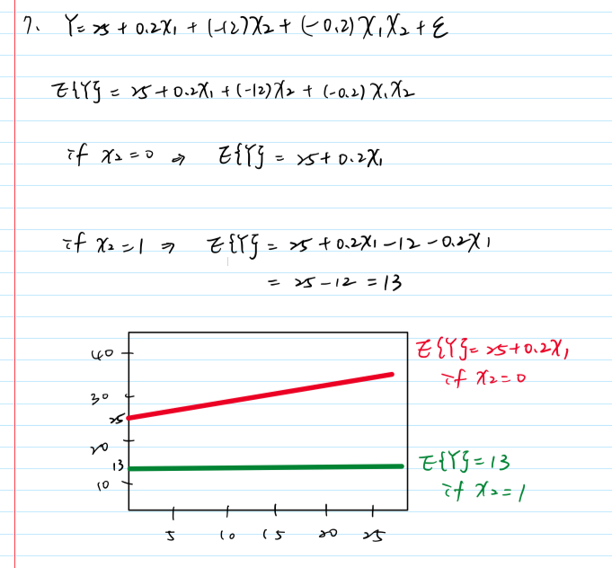
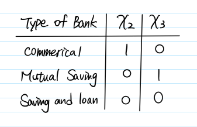
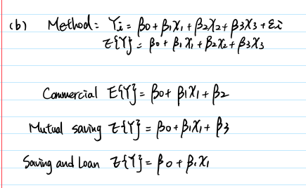

```{r setup, include=FALSE}
knitr::opts_chunk$set(echo = TRUE)
library(tidyverse)
```
1. (**7.1**) State the number of degrees of freedom that are associated with each of the following extra sums of squares: SSReg(X1 | X2), SSReg(X2 | X1, X3), SSReg(X1, X2 | X3, X4),
SSReg(X1, X2, X3 | X4, X5).

A note about the notation. SSReg(A | B) is the extra sum of squares that appeared as aresult of including variables A into the regression model that already had variables B in it. Thus, it is used to compare the full model with both A and B in it against the reduced model with only B.

Ans: We can calculate degrees of freedom by counting the number of variables to the left of the "|".
- SSReg(X1 | X2) = 1
- SSReg(X2 | X1, X3) = 1
- SSReg(X1, X2 | X3, X4) = 2
- SSReg(X1, X2, X3 | X4, X5) = 3

2. (**7.2**) Explain in what sense the regression sum of squares SSReg(X1) is an extra sum of squares.
- Extra sum of squares uses extra sums of squares in tests for regression coefficients. For example, there is a response variable Y and 2 predictor variables X1 and X2:
- The reduce model is Y = $\beta0$ + $\beta1$X1 + ei and compute SSE(X1)
- The full model is Y = $\beta0$ + $\beta1$X1 + $\beta2$X2 + ei and compute SSE(X1, X2)
- So the equation can be denoted as SSE(X1) = SSE(X1, X2) + SS? How can we define SS? As the extra sum of squares and denote it by SSR(X2|X1) so we can write as
$$
SSR(X2|X1) = SSE(X1) − SSE(X1, X2)
$$
- SSR(X2|X1) calculates the decrease in SSE when X2 is added to the regression model, given X1 is already present.

Reference:
- https://365datascience.com/tutorials/statistics-tutorials/sum-squares/
- https://www.stat.colostate.edu/~riczw/teach/STAT540_F15/Lecture/lec09.pdf


3. (**7.28b**) For a multiple regression model with five X variables, what is the relevant extra sum of squares for testing

The equation might be:
$$
Y = \beta0 + \beta1X1 + \beta2X2 + \beta3X3 + \beta4X4 + \beta5X5 + ei
$$
(a) whether or not $\beta5$ = 0?
- SSR(X5 | X2, X3, X4, X5)
(b) whether or not $\beta2$ = $\beta4$ = 0?
- SSR(X2, X4 | X1, X3, X5)

4. (**7.28b, Stat-615 only**) Show that SSReg(X1, X2, X3, X4) = SSReg(X2, X3)+SSReg(X1 | X2, X3)+SSReg(X4 | X1, X2, X3)

Reference: 
- https://www.stat.colostate.edu/~riczw/teach/STAT540_F15/Lecture/lec09.pdf
- https://www.math.arizona.edu/~piegorsch/571A/STAT571A.Ch07.pdf



5. (**7.3, 7.24, 7.30**)  Continue working with the Brand Preference data, which are available on
our Blackboard, on http://statweb.lsu.edu/EXSTWeb/StatLab/DataSets/NKNWData/CH06PR05.txt,
and in the previous homework.

Recall the variables: It was collected to study the relation between degree of brand liking (Y) and moisture content (X1) and sweetness (X2) of the product.

(a) Obtain the ANOVA table that decomposes the regression sum of squares into extra sum of squares associated *with X1* and *with X2, given X1*.

```{r}
brand <- read.table("./data/CH06PR05.txt")
brand %>%
  rename(Y = V1, X1 = V2, X2 = V3) -> brand

# SSR(X1) 
X1 <- lm(Y ~ X1, data = brand)

# SSR(X2|X1)
X2givenX1 <- lm(Y ~ X1 + X2, data = brand)

anova(X1)
anova(X2givenX1)
```

(b) Test whether X2 can be dropped from the model while X1 is retained.

Consider dropping X2, the hypothesis is H0: $\beta2 = 0$ = 0 vs $\beta2 \neq 0$. According to the analysis of variance table above, the p-value of X2 is 2.011e-05, indicating that there is evidence that $beta2 neq 0$, so X2 cannot be removed from the model.

(c) Fit first-order simple linear regression for relating brand liking (Y) to moisture content (X1).

```{r}
summary(X1)$coefficients[, 1]
```
$$
\hat{Y} = 50.775 + 4.425X1
$$

(d) Compare the estimated regression coefficient for X1 with the corresponding coefficient obtained in (a).
- In the `X2givenX1` model, the estimated regression coefficient for X1 is 4.425.
- In the `X1` model, the estimated regression coefficient for X1 is 4.425, too.
```{r}
summary(X2givenX1)$coefficients[2,1]
summary(X1)$coefficients[2,1]
```

(e) Does SSreg(X1) equal SSreg(X1|X2) here? Is the difference substantial?
- There are no different between sum of squares of X1. The first model SSReg(X1) is 1566.45, and the second model SSReg(X1|X2) is 1566.45. 
```{r}
# SSReg(X1)
anova(X1)

# SSReg(X1|X2)
X1givenX2 <- lm(Y ~ X2 + X1, data = brand)
anova(X1givenX2)
```


(f)
- Regress Y on X2 and obtain the residuals.
```{r}
residuals(lm(Y ~ X2 , data = brand))
```

- Regress X1 on X2 and obtain the residuals.
- Regress residuals from the model “Y on X2” on residuals from the model “X1 on X2”; compare the estimated slope, error sum of squares with #1. What about $R^2$?

6. (**8.13**) Consider a regression model Y = $\beta0$ + $\beta1$X1 + $\beta2$X2 + e, where X1 is a numerical variable, and X2 is a dummy variable. Sketch the response curves (the graphs of E(Y) as a
function of X1 for different values of X2), if $\beta0$ = 25, $\beta1$ = 0.2, and $\beta2$ = −12.

- The blue line indicates the association between E(Y) and X1 when X2 = 0
- The green line indicates the association between E(Y) and X1 when X2 = 1



7. Continue the previous exercise. Sketch the response curves for the model with interaction,
Y = $\beta0$ + $\beta1$X1 + $\beta2$X2 + $\beta3$X1X2 + e, given that $\beta3$ = −0.2

- The red line indicates the association between E(Y) and X1 when X2 = 0
- The green line indicates the association between E(Y) and X1 when X2 = 1




8. (**8.34**) In a regression study, three types of banks were involved, namely, (1) commercial, (2) mutual savings, and (3) savings and loan. Consider the following dummy variables for the type of bank:



(a) Develop the first-order linear regression model (no interactions) for relating last year’s profit or loss (Y) to size of bank (X1) and type of bank (X2, X3).
$$
Yi = \beta0 + \beta1X1 + \beta2X2 + \beta3X3 + ei
$$
(b) State the response function for the three types of banks.
- In this data, we can see the `X2` and `X3` are dummy variables.



(c) Interpret each of the following quantities: (1) $\beta2$, (2) $\beta3$, (3) $\beta2$ − $\beta3$.

- Y represents profit or loss, X1 represents size, and X2 and X3 represent dummy variables.
1. $\beta2$:
2. $\beta3$
3. $\beta2$ − $\beta3$: 

